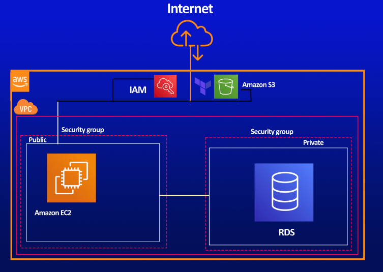

<h1>AWS_CLOUD first assigment</h1>
<h4>In this project I will deploy a aws cloud project using terraform as infrastructure</h4>
<h4>This project has one VPC and two subnets one is private and the other one is public. The public subnet will contain the EC2 instance and it can get access from the public. Meanwhile the private subnet contains one RDS database and it can be accessed only from the public subnet.</h4>
<h4>Both of subnets will have security groups, route tables, and internet gateaway.</h4>

The project is shown is the picture below!

