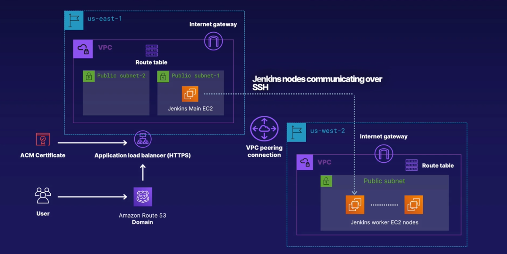

<h2>PROJECT_1</h2>

Over here I will commit my project with the architecture as shown in the picture
We will use two regions. Both of them are going to have VPC and subnets. One region is going to have two public subnets and the other only one private subnet, and we will connect the public subnet with the private subnet with the help of Jenkins.
Sit tight, relax, and enjoy the show!!!

